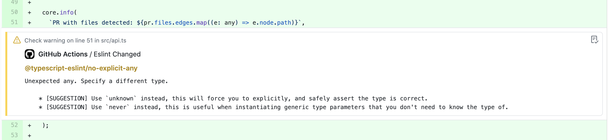

<div align="center">
  <br />
  <br/>
  <br/>
  <p align="center">
    
  </p>
  <br />
  <h1>
      eslint-plus-action
  </h1>
  <br />
  <br />
  <br />
  <br />
  <sup>
    A flexible and dead simple Github Action which runs ESLint against the changed files in a PR with customizable options and rich summaries.  ESLint issues are annotated inline on your PR diff.
  </sup>
  <br />
  <br />
  <br />
  <br />
  <br />
  <br />
  <br />
  <br />
  <br />
</div>

## Dead Simple

As easy as the following, and even the more advanced features are just a few extra lines.

```yml
name: "my-workflow"
on: [pull_request]

jobs:
  eslint:
    runs-on: ubuntu-latest
    steps:
    - uses: actions/checkout@v2
    - uses: bradennapier/eslint-plus-action@v3.3.0-beta.3
```

## Features

- :tada: [**Works on Forked PR's Securely!**](https://github.com/bradennapier/eslint-plus-action#handle-forked-prs) :tada:
- [Inline Annotations of ESLint Warnings & Errors](https://github.com/bradennapier/eslint-plus-action/pull/3/files)
- Customizable ESLint options
- [Optional summary comments on each push to the PR](https://github.com/bradennapier/eslint-plus-action/pull/3)
- [Links to the rule documentation when available](https://github.com/bradennapier/eslint-plus-action/pull/3#issuecomment-646635983)
- [Annotation Summary Page](https://github.com/bradennapier/eslint-plus-action/pull/3/checks?check_run_id=788235048)
- Suggestions are printed when enabled (not yet provided as change suggestions)
- Button to run ESLint Fix [COMING SOON]
- More...

> The summary comments have some redundancy when there are suggestions available.  This will be improved.

> The `fix` property is not yet setup but will come shortly. If fixes are available, it will render an action button to run the fix as well.

## Configuration

You provide configuration properties within your workflow by using the `with` property.  See the `Simple Workflow Example` for an example of providing your github-token.  

> `array` types are expected to be comma-separated values

### General Configuration Properties

|    Property   | Type | Default | Required | Description |
| ------------- | ---- | ------- | -------- | ----------- |
| github-token | string | secrets.GITHUB_TOKEN | false | Your Github token. You only need to provide this if you want to use something other than `secrets.GITHUB_TOKEN` |
| issueSummary | boolean | true | false | Should the bot provide a summary of the results as a comment? |
| issueSummaryType | string | compact | false | Changes the PR comment to be "full" (as shown on actions page) or "compact" |
| issueSummaryMethod | string | edit | false | When issueSummary is enabled, allows having the bot edit or refresh the comment on each new push, can be 'edit' or 'refresh' |
| issueSummaryOnlyOnEvent | boolean | false | false | Only provide the issue summary comment if there are warnings or errors present? |
| annotateWarnings | boolean | true | false | By setting this to "false", only errors will be annotated |
| reportSuggestions | boolean | true | false | Report suggestions when available within the annotations? |
| reportIgnoredFiles | boolean | false | false | Report a list of any ignored files? |
| reportWarningsAsErrors | boolean | false | false | Report any eslint warnings as errors? |
| extensions | array | .js,.jsx,.ts,.tsx | false | An array of extensions to lint |
| includeGlob | array | \*\*/\* | false | Optional array of globs to include from the changed files list |
| ignoreGlob | array | none | false | Optional array of globs to ignore from the changed files list |
| configFile | string | none | false | A config file to use if the default config resolution doesn't work. |
| rulePaths | array | none | false | Optional paths to custom rules directories to include. |
| errorOnUnmatchedPattern | boolean | false | false | Throw error if unmatched pattern is seen? |
| useEslintrc | boolean | true | false | Use eslintrc? |
| useEslintIgnore | boolean | true | false | Use eslintignore? |
| fix | boolean | false | false | Commit fixes when possible (UNFINISHED) |
| npmInstall | boolean | false | false | Force run npm ci (or yarn) for you. If you do not use this option, be sure to install the project dependencies before running this action.  By default it will run if a node_modules directory is not found or this is set to true |

> The official settings can always be seen by viewing the [`action.yml`](https://github.com/bradennapier/eslint-plus-action/blob/master/action.yml) schema for the action.

## Handle Forked PRs

GitHub Actions only have read permissions when a forked PR is opened.  However, we can work around this by setting up a scheduled job in our workflow.  This runs at your given interval and will automatically enable serialization of results as workflow artifacts when required.  Since these will **always run against our master branch**, we can safely run our results without concern that the fork has modified the workflow in any way which may be malicious.

Each time the schedule job runs it will run through any new artifacts and update the PR with the results like normal.  *If a job hasn't been detected in the last 24 hours then the action will no longer save artifacts.*  This is so you do not needlessly use up your data storage.

> Note that we delete the artifacts as soon as they have been processed so they will
> not use up your storage for very long.

> You can optionally add additional optimization by also making sure to run this action
> on the `[closed]` event so that we can cleanup all the artifacts when this occurs.

<br />

> The scheduler will not start running until you have pushed the workflow to your main 
> branch (`master`).  If it still does not run you can try pushing an empty commit, it 
> seems that is sometimes required `git commit --allow-empty -m 'redeploy schedule action'`

```yml
name: "lint"
on: 
  # by adding a schedule task to this workflow we will automatically
  # begin serializing read-only runs and handling them. The cron job
  # below is set to run every 15 minutes, GitHub will ignore anything
  # under 10 minutes and run every 10 minutes anyway.
  schedule:
    - cron: '*/15 * * * *'
  pull_request:
    types:
      - opened
      - synchronize
      - closed
jobs:
  lint:
    runs-on: ubuntu-latest
    steps:
    - uses: actions/checkout@v2
    - uses: bradennapier/eslint-plus-action@v3.3.0-beta.3
```

## Examples

### Simple Workflow Example

Below is a basic example which should get you going.  You can view the action.yml to see what other properties are available for customization.

```yml
name: "my-workflow"
on: [pull_request]

jobs:
  eslint:
    runs-on: ubuntu-latest
    steps:
    - uses: actions/checkout@v2
    - uses: bradennapier/eslint-plus-action@v3.3.0-beta.3
```

### Environment Variables

There may be times that you need to provide a `NPM_TOKEN` so that the action can install your private repos.  You do this by adding the secret to your repo `Settings -> Secrets` then providing it as an environment variable to the action:

```yml
jobs:
  eslint:
    runs-on: ubuntu-latest
    steps:
    - uses: actions/checkout@v2
    - uses: bradennapier/eslint-plus-action@v3.3.0-beta.3
      env:
        NPM_TOKEN: ${{secrets.NPM_TOKEN}}
```

### Providing Parameters

```yml
jobs:
  eslint:
    runs-on: ubuntu-latest
    steps:
    - uses: actions/checkout@v2
    - uses: bradennapier/eslint-plus-action@v3.3.0-beta.3
      env:
        NPM_TOKEN: ${{secrets.NPM_TOKEN}}
      with: 
        issueSummaryType: full
        reportIgnoredFiles: true
```

## More Previews

<p align="center">
  
</p>

## Credits

This action was adapted from other actions which didn't quite work for me but were close.  So special thanks to them for helping me get here.

- https://github.com/marketplace/actions/eslint-annotate
- https://github.com/marketplace/actions/eslint-action
